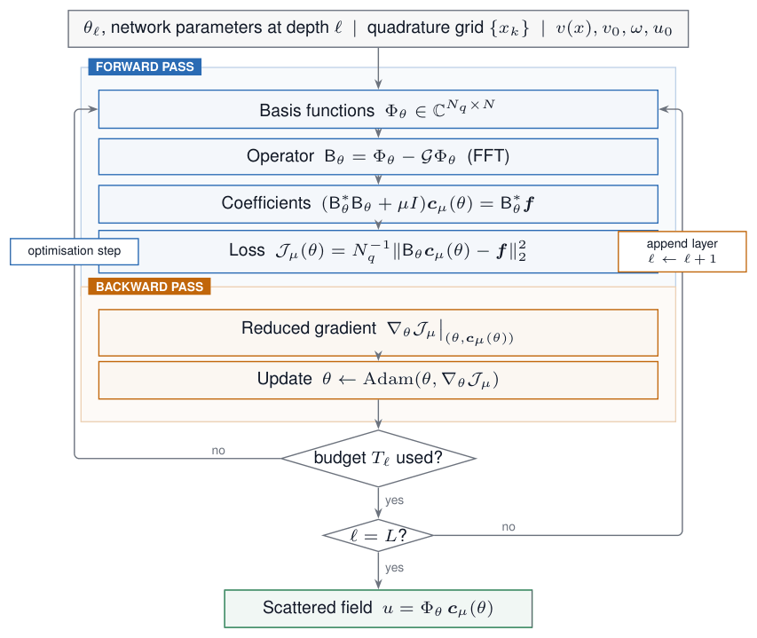
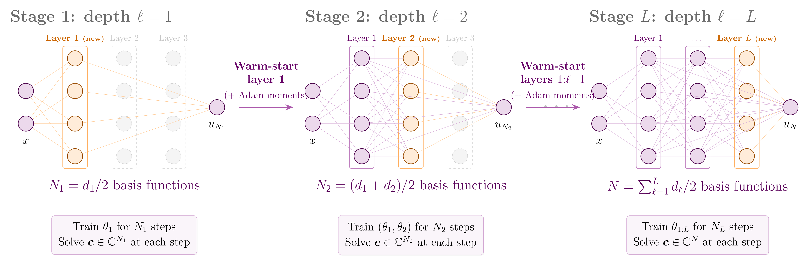
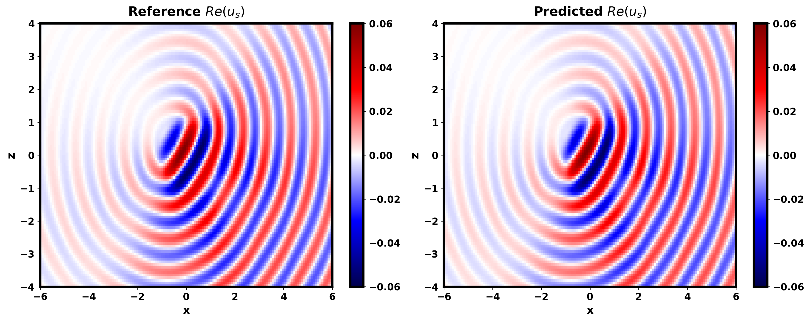
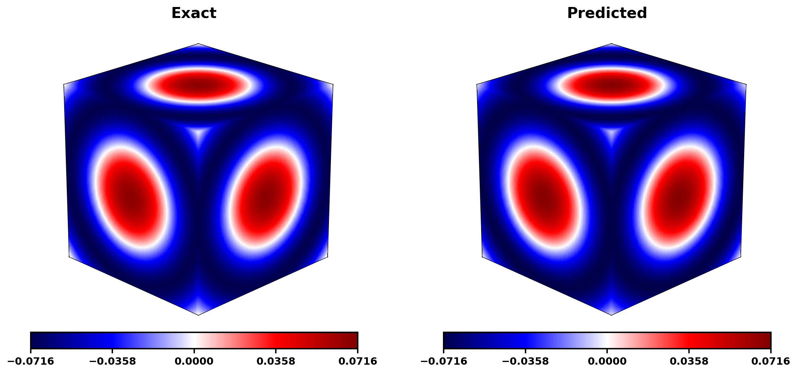
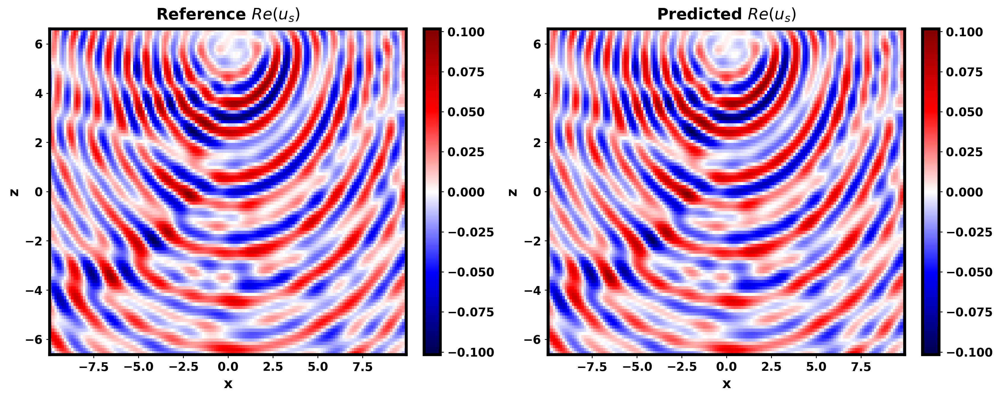
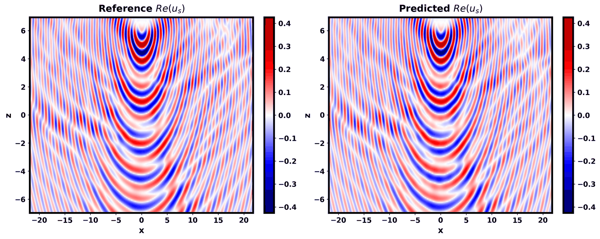
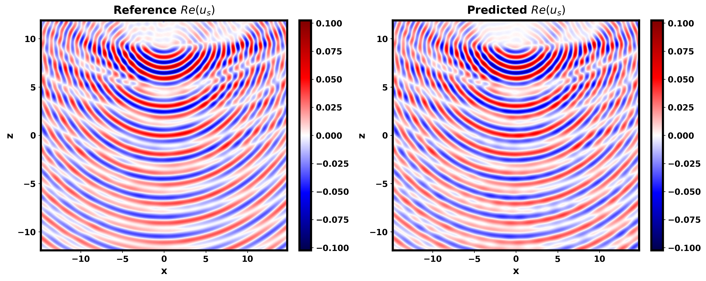

<p align="center">
  
</p>

<h1 align="center">NAP-Wave</h1>
<p align="center">A <b>N</b>eural <b>A</b>daptive <b>P</b>lane-<b>Wave</b> Architecture for High-Frequency Helmholtz Problems</p>

<p align="center">
Hamza Kamil<sup>1,*</sup> &nbsp;·&nbsp; Mohammad Mahdi Abedi<sup>2</sup> &nbsp;·&nbsp; David Pardo<sup>2,1,3</sup>
</p>
<p align="center">
<sup>1</sup> Basque Center for Applied Mathematics (BCAM), Bilbao, Spain<br>
<sup>2</sup> University of the Basque Country (UPV/EHU), Leioa, Spain<br>
<sup>3</sup> Ikerbasque: Basque Foundation for Science, Bilbao, Spain
</p>
<p align="center">
<a href="mailto:hkamil@bcamath.org">hkamil@bcamath.org</a> ·
<a href="mailto:mohammadmahdi.abedi@ehu.eus">mohammadmahdi.abedi@ehu.eus</a> ·
<a href="mailto:david.pardo@ehu.eus">david.pardo@ehu.eus</a>
</p>

<p align="center">
  
  
  
  
  
  <a href="https://doi.org/10.5281/zenodo.22085651"></a>
</p>

<p align="center">
<i>Paper not yet published. Details below will be updated once available.</i>
</p>

---

### Contents

- [Overview](#overview)
- [Installation](#installation)
- [Quickstart](#quickstart)
- [Config guideline](CONFIG_GUIDELINE.md)
- [How it works](#how-it-works)
- [Using your own velocity model](#using-your-own-velocity-model)
- [Data & checkpoints](#data--checkpoints)
- [Results](#results)
- [Evaluation and plotting](#evaluation-and-plotting)
- [Repository structure](#repository-structure)
- [Contributing](CONTRIBUTING.md)
- [Citation](#citation)
- [License](#license)
- [Release info](#release-info)

---

## Overview

NAP-Wave is a JAX-based physics-informed neural solver for acoustic wave propagation in heterogeneous media. It represents the scattered wavefield with a neural plane-wave basis and combines it with:

- **A Green's-integral (Lippmann-Schwinger) physics loss**, so training does not require labeled wavefield data.
- **Least-squares coefficient solves**, where the linear combination coefficients of the basis are solved in closed form via ridge-regularized least squares at every step, while the nonlinear network parameters are trained by Adam.
- **Adaptive-depth training**, where the network always starts shallow (1 layer) and grows layer-by-layer up to the target depth over a prescribed schedule of per-stage iteration counts.

The codebase includes full training pipelines, checkpointing, evaluation, and plotting utilities, exercised on synthetic 2D/3D and geophysical real velocity models (e.g. Marmousi, Overthrust, Otway).

## Installation

To install the `nap_wave` library in editable mode along with its dependencies, run

```bash
pip install -e .
```

**GPU note:** To run on GPU, you will need to install the CUDA-specific JAX packages. Use `pip install -e ".[cuda]"`, `pip install "jax[cuda12]"`, or the appropriate JAX CUDA extra for your platform to enable GPU support.

## Quickstart

We make available all the example studies from our paper. To get started, go into any folder under `Examples/`; each case has a `config.py` that lets you set the problem parameters, and a `main.py` to run it.

Do this:

```bash
cd Examples/Marmousi
python main.py
```

In any config file (see any `Examples/*/config.py` for concrete values), you will have the following sections that you can edit:

- `problem`: domain size, background velocity, source location, frequency.
- `arch`: `width` and target `depth`.
- `training`: includes the adaptive-depth per-stage iteration schedule (`training.stage_iterations`, one entry per depth from 1 to `depth`, summing to the total epoch budget), plus logging/checkpoint cadence (`print_every`, `save_every`, `keep_chpts`, ...).
- `least_squares`: the ridge-regularization decay schedule for the (always-least-squares) coefficient solve — `ls_reg_start` and `ls_reg_end` (regularization decays exponentially between them over training).

In `main.py`, we build the problem from the config, construct a `Trainer`, and call `trainer.fit_evaluate()`. Training writes periodic checkpoints and a metrics file (`.npy`) with the training/evaluation history.

See **[CONFIG_GUIDELINE.md](CONFIG_GUIDELINE.md)** for every config entry across all sections — type, required/optional, default, and the exact rule or choices it must satisfy. A bad config (wrong type, wrong sign, unrecognized choice, a mismatched schedule length, ...) is caught there and reported all at once, before any problem/model building starts.

## How it works

### Training loop

Each outer iteration evaluates the current network's basis functions on a quadrature grid, applies the discretized Green's operator via FFT, and forms the linear system `B`. The **linear coefficients `c`** are solved in closed form (inner problem, ridge-regularized least squares via Cholesky factorization on the normal equations) at every step, while the **nonlinear network parameters `θ`** are updated by a single Adam step on the *reduced* loss.

<p align="center">
  
</p>

> **Warning — always use `float64`.** `problem.precision` must always be set to `"float64"` (with `jax.config.update("jax_enable_x64", True)` set before importing JAX/trainer, as in every `Examples/*/main.py`). The Cholesky solve on the ridge-regularized normal equations `(B^*B + mu I)c = B^*f` is ill-conditioned enough that `float32` is not numerically stable and degrades accuracy. Even though `float64` costs meaningfully more compute (roughly 2x slower on the LS solve alone) than `float32`. Do not switch to `float32` to speed up training; the least-squares coefficient solve needs the extra precision to stay stable and accurate.

### Adaptive-depth schedule

Rather than training a deep network from scratch, NAP-Wave always grows the network one layer at a time. At stage `ℓ`, only the newest layer is freshly initialized; all previously trained layers are warm-started from the previous stage. Each stage trains for a prescribed number of steps before the network grows again, up to the target depth `L`.

<p align="center">
  
</p>

## Using your own velocity model

To train on a new velocity model, you need:

1. **A validation data file** (`.npz`), saved at `<base_path>/data/data_<problem.name>_validation.npz` — the filename must match `problem.name` exactly, e.g. `problem.name = "MyModel"` needs `data/data_MyModel_validation.npz`. Contents: coordinate arrays, a reference velocity or contrast field, and (if available) a reference wavefield for evaluation — see `resolve_reference_data_path`/`build_gi_problem`/`build_gi_problem_3d` in `nap_wave/problem_setup.py` for the exact array names expected (`xz_ref` in 2D or `xyz_ref` in 3D, plus `v_ref`/`U_ref`, optionally `contrast`/`gi_damp`).
2. **A `config.py`** for the new case, adapted from an existing example, with `problem.domain`, `problem.v0` (background velocity), and `problem.source` set for your model, plus `arch.width`/`arch.depth`, a `training.stage_iterations` schedule (one entry per depth stage), and `least_squares.ls_reg_start`/`ls_reg_end`.
3. **A `main.py`** that mirrors an existing example's entry point (build the problem, construct the `Trainer`, call `fit_evaluate()`).

The easiest path is to copy an existing `Examples/*` folder, point the data loading at your new file, and adjust the domain/source/frequency parameters in `config.py`.

## Data & checkpoints

Each example's validation data (`data/*.npz`) ships with this repository, so every case under `Examples/` is runnable out of the box.

The **trained checkpoints** (`Results/checkpoint.pkl`) and **raw prediction plots** for all five examples (`Fluid_cylinder_scattering`, `Radial_velocity_gradient_3D`, `Marmousi`, `Overthrust`, `Otway`) are hosted separately on Zenodo, to keep the codebase lightweight:

**[NAP-Wave: Validation data and saved checkpoints — Zenodo](https://doi.org/10.5281/zenodo.22085651)** (DOI: `10.5281/zenodo.22085651`)

The record's files are currently restricted while the paper is under review — request access via the Zenodo page above. Once accessible, download the archive and place each example's `checkpoint.pkl` into that example's `Results/` folder to reproduce the metrics and figures in the [Results](#results) table below without retraining.

## Results

Metrics below are computed directly from each example's checkpoint in `Examples/*/Results/checkpoint.pkl`, via `Evaluation/evaluate.py`, and match each run's own training-history values. GI loss is the final Green's-integral residual reached at the checkpoint's epoch; rel. L2 is the relative L2 error against the reference/exact field on that example's validation grid.

| Model | Epoch | GI loss | Rel. L2 error |
|---|---|---|---|
| Fluid-cylinder scattering | 20,000 | 2.36e-09 | 0.99% |
| 3D radial velocity gradient | 52,100 | 4.09e-08 | 1.59% |
| Marmousi | 26,100 | 9.95e-09 | 5.11% |
| Overthrust | 100,000 | 5.79e-08 | 8.94% |
| Otway | 219,000 | 6.97e-09 | 9.73% |

Reference vs. predicted scattered field:

<p align="center">
  <b>Fluid-cylinder scattering</b><br><br>
  
</p>

<p align="center">
  <b>3D radial velocity gradient</b><br><br>
  
</p>

<p align="center">
  <b>Marmousi velocity model</b><br><br>
  
</p>

<p align="center">
  <b>Overthrust velocity model</b><br><br>
  
</p>

<p align="center">
  <b>Otway velocity model</b><br><br>
  
</p>

## Evaluation and plotting

- `Evaluation/plot_metrics.py` — plots loss and relative-L2 error curves from a metrics file, with moving-average smoothing to reduce the noise.
- `Evaluation/evaluate.py` — rebuilds the problem and model from a saved checkpoint and computes predictions.

## Repository structure

```
nap_wave/                  Core library
  archs.py                  PlaneWaveBasisNet
  trainer.py                Trainer: Adaptive-depth training loop, checkpointing
  loss.py                    Green's-integral loss, Adam optimizer, and learning-rate schedule
  least_squares.py          Closed-form ridge least-squares coefficient solves
  lippmann_schwinger.py      Green's function / FFT convolution utilities
  problem_setup.py          Problem setup: domain, background field, dtypes/precision
  utils.py                   Generic helpers: precision casting, dtype lookup, PyTree/pickle I/O

Examples/                  Per-case study folders, each with its own config.py + main.py
  Fluid_cylinder_scattering/    2D problem with a known analytic solution
  Radial_velocity_gradient_3D/  3D problem with a known analytic solution
  Marmousi/                  2D Marmousi velocity model
  Overthrust/                2D Overthrust velocity model
  Otway/                     2D Otway velocity model

Evaluation/                 Generic evaluation/plotting utilities
  evaluate.py                Rebuild a model from a checkpoint and compute predictions
  plot_metrics.py            Training-curve plots (GI loss, rel-L2)

assets/                    Logo, method figures, and other static assets
  figures/                   Method diagrams and example result figures used in this README
pyproject.toml             Package metadata and dependencies (pip install -e .)
```

## Contributing

Interested in extending NAP-Wave (multi-GPU, multi-frequency/multi-source, operator learning, ...)? See **[CONTRIBUTING.md](CONTRIBUTING.md)** for known limitations, potential improvements, and how to submit a pull request.

## Citation

A full citation of the paper entry will be added here once it is published.

```
@article{kamil_napwave,
  title   = {NAP-Wave: Neural Adaptive Plane-Wave Basis Functions for Heterogeneous Seismic Modeling},
  author  = {Kamil, Hamza and Abedi, Mohammad Mahdi and Pardo, David},
  journal = {TBD},
  year    = {TBD}
}
```

## License

MIT — see [LICENSE](LICENSE).

## Release info

- **Developer:** Hamza Kamil
- **Version:** 0.0.1
- **First release date:** 01-09-2026
- **JAX version:** 0.9.1 (see `pyproject.toml`)
